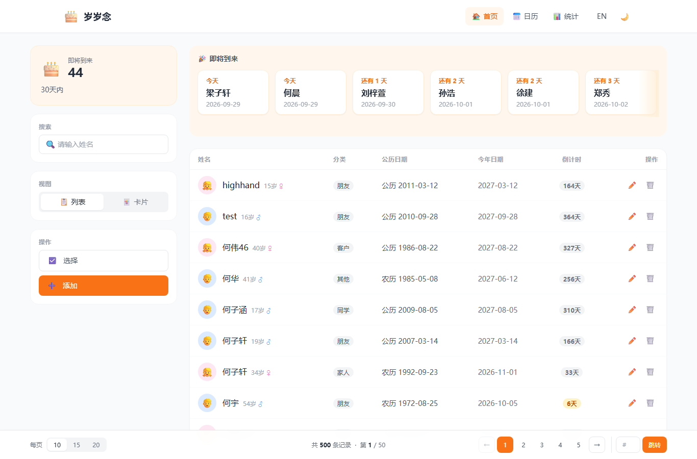
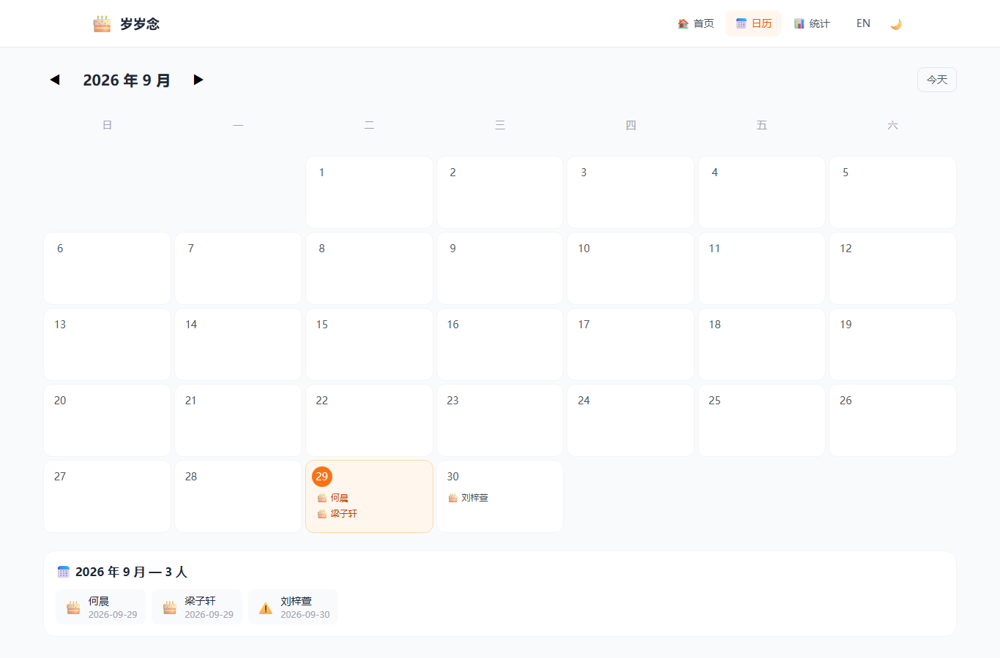
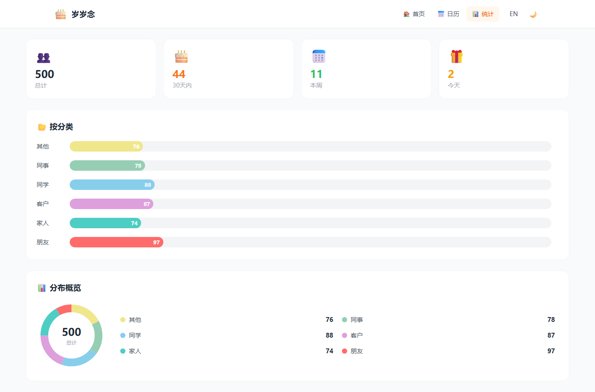

<div align="center">

# 🎂 Yearn · 岁岁念
### 年年岁岁，惦念不忘

> 带农历支持、温暖现代的生日提醒应用 · FastAPI + Vue 3

[](./README.md)


</div>

---

> 📘 **本文档为中文。** 想看英文？→ **[Read in English →](./README.md)**

## 📸 界面预览

<table>
  <tr>
    <td align="center" width="33%">
      <a href="./docs/screenshots/home_list.png"></a>
      <br/><b>🏠 首页</b> · 「即将到来」横向卡片 + 列表/卡片视图 + 分页
    </td>
    <td align="center" width="33%">
      <a href="./docs/screenshots/calendar.png"></a>
      <br/><b>📅 日历</b> · 农历 + 公历，当日高亮
    </td>
    <td align="center" width="33%">
      <a href="./docs/screenshots/stats.png"></a>
      <br/><b>📊 统计</b> · 概览、按分类、分布饼图
    </td>
  </tr>
</table>

> 🔎 **小提示**：统计页任意「概览卡 / 分类条 / 饼图扇区」都可点击，弹出该维度下的明细记录。

---

## 🚀 本地从零启动（推荐）

> 💡 **跑起整个项目最简单的方式** —— 一条后端进程同时提供 API **和** 已构建的前端，提醒调度也会自动启动。

```bash
git clone https://github.com/perry466/Yearn.git
cd Yearn/backend
pip install -r requirements.txt        # ① 安装后端依赖

cd ../frontend
npm install
npm run build                          # ② 关键：构建 frontend/dist（不在 git 里）

cd ../backend
python run.py                          # ③ 启动 API + 调度 + 托管前端
```

然后打开 **http://localhost:8000**。随时用 `python stop.py` 停止。

> ⚠️ `frontend/dist` 被 git 忽略，所以 clone 后**必须跑一次 `npm run build`**，否则网页是空白的。完整图文步骤见 [使用指南（中文）](./docs/USAGE_zh.md)。

---

## 📑 目录

> 📱 **第一次用？** 先看 **[使用指南（中文）](./docs/USAGE_zh.md)** · **[Usage Guide (English)](./docs/USAGE.md)** —— 带截图，逐页讲怎么用。

- [📋 一、环境要求](#一、环境要求)
- [📁 二、项目结构](#二、项目结构)
- [🚀 三、快速启动](#三、快速启动)
- [🌐 四、局域网/服务器访问说明](#四、局域网服务器访问说明)
- [🏭 五、生产部署建议](#五、生产部署建议)
- [🔔 六、提醒系统](#六、提醒系统)
- [💾 七、数据模型](#七、数据模型)
- [🔌 八、接口一览](#八、接口一览)
- [❓ 九、常见问题](#九、常见问题)
- [🔧 十、开发指引（简）](#十、开发指引（简）)

---

## 📋 一、环境要求

| 依赖 | 版本 | 说明 |
| --- | --- | --- |
| Python | 3.11+ | 推荐 3.11/3.12，有预编译 wheel |
| Node.js | 18+ | 前端构建运行环境 |
| npm | 9+ | 随 Node 一起安装 |
| Git | 任意 | 拉取代码 |

---

## 📁 二、项目结构

```
yearn/
├── backend/                # 后端（FastAPI + SQLite）
│   ├── app/
│   │   ├── core/           # config.py（提醒配置）、database.py
│   │   ├── models/         # ORM 模型
│   │   ├── schemas/        # Pydantic 模型（含字段校验）
│   │   ├── services/       # lunar（农历）、reminder（提醒）、birthday（CRUD）
│   │   ├── routers/        # REST 接口
│   │   ├── scheduler.py    # 每日提醒调度
│   │   └── main.py         # 入口
│   ├── requirements.txt
│   ├── reset_100.py        # 生成 100 条测试数据
│   └── birthday.db         # SQLite 数据库（首次运行自动生成）
├── frontend/               # 前端（Vue 3 + Vite）
│   ├── src/                # 源码
│   ├── vite.config.js      # 已配置 host / allowedHosts / /api 代理
│   └── package.json
├── README.md               # 英文说明
└── README_zh.md            # 本文件
```

---

## 🚀 三、快速启动

> **推荐 —— 单服务（一条命令）**：装好依赖、构建一次前端后，一条后端进程同时提供
> **API 和已构建的前端**，提醒调度也会自动启动。

```bash
cd /path/to/yearn/backend
pip install -r requirements.txt
cd ../frontend && npm install && npm run build   # 构建 frontend/dist（必做，不在 git 中）
cd ../backend
python run.py            # 在 :8000 上提供 API + 调度 + 前端
```

打开 **http://localhost:8000**。随时用 `python stop.py` 停止。

> `frontend/dist` 被 git 忽略，clone 后必须跑一次 `npm run build`，否则网页空白。
> 提醒配置建议在网页 **「设置」** 页（`/settings`）里改，不必动配置文件。

### 1. 启动后端（独立 / 开发 API）

```bash
cd /path/to/yearn/backend

# 创建并激活虚拟环境（首次）
python3 -m venv venv
source venv/bin/activate

# 安装依赖（首次）
pip install -r requirements.txt

# 启动（监听所有网卡，方便局域网访问）
uvicorn app.main:app --host 0.0.0.0 --port 8000
```

- API 根地址：`http://<服务器IP或域名>:8000`
- 接口文档（Swagger）：`http://<服务器IP或域名>:8000/docs`
- 数据库 `birthday.db` 会在首次启动时自动创建。
- 当 `frontend/dist` 存在时，这个进程也会在 `/` 直接托管前端页面。

> **Windows 差异**：用 PowerShell 时先 `cd backend`，再
> `python -m venv venv`、`.\venv\Scripts\Activate.ps1`、`pip install -r requirements.txt`、
> `uvicorn app.main:app --host 0.0.0.0 --port 8000`。
>
> **关于 PYTHONPATH**：只要在 `backend/` 目录下执行 `python -m uvicorn ...` 即可，
> 当前目录会自动加入 Python 路径，无需额外设置；若要从别的目录运行，
> 可 `export PYTHONPATH=/path/to/yearn/backend` 后再执行。（或者直接用 `python run.py`，
> 它会自动把路径设好。）

### 2. 前端开发服务器（可选，热更新）

如果想开发时实时热更新，可以把前端单独跑在 `:5173`（它会把 `/api` 代理到 `:8000` 后端）：

```bash
cd /path/to/yearn/frontend
npm install
npm run dev
```

- 应用地址：`http://<服务器IP或域名>:5173`
- 例如你这台机器：`http://roc-ubuntu.local:5173`

### 3. 初始化测试数据（可选）

```bash
cd /path/to/yearn/backend
source venv/bin/activate
python reset_100.py        # 清空并生成 100 条随机记录
```

> 该脚本会删除全部已有数据后重新随机生成，仅用于演示，**生产环境请勿执行**。

---

## 🌐 四、局域网/服务器访问说明

前端 `vite.config.js` 已经做了两件事，保证局域网可访问：

```js
server: {
  host: true,                                   // 监听 0.0.0.0，允许其他设备访问
  allowedHosts: ['roc-ubuntu.local', 'localhost', '127.0.0.1'],
  proxy: { '/api': { target: 'http://localhost:8000', changeOrigin: true } },
}
```

- 如果你用 **IP（如 `192.168.1.10:5173`）** 访问而不是 `.local` 域名，
  需要把 `allowedHosts` 改为 `true`（放行所有主机），否则浏览器会提示
  *“Blocked request. This host is not allowed”*。
- 生产环境**不建议**长期用 `npm run dev`，请走下面的「生产部署」方案。

---

## 🏭 五、生产部署建议

`npm run dev` 是开发服务器，不适合长期对外。构建静态文件（后端会自动托管 `frontend/dist`），并可在前面用 Nginx 做反向代理：

```bash
cd /path/to/yearn/frontend
npm install
npm run build          # 产物在 frontend/dist/
```

Nginx 示例配置（`/etc/nginx/sites-available/yearn`）：

```nginx
server {
    listen 80;
    server_name roc-ubuntu.local;   # 或你的域名/IP

    # 前端静态文件
    root /path/to/yearn/frontend/dist;
    index index.html;
    try_files $uri $uri/ /index.html;

    # 后端 API 反代
    location /api/ {
        proxy_pass http://127.0.0.1:8000;
        proxy_set_header Host $host;
        proxy_set_header X-Real-IP $remote_addr;
    }
}
```

后端用 systemd / nohup 常驻运行：

```bash
cd /path/to/yearn/backend
source venv/bin/activate
uvicorn app.main:app --host 127.0.0.1 --port 8000
```

> 提醒调度（每日 09:00 Asia/Shanghai，启动时还会立即检查一次）会随应用**自动启动**，
> 不需要单独进程。同一个 `uvicorn app.main:app` 进程也会托管已构建的 `frontend/dist`，
> 所以单服务就覆盖了 API + 网页 + 调度。

---

## 🔔 六、提醒系统

提醒配置都在**应用里完成** —— 打开网页的 **「设置 (🔔)」** 页
（单服务启动后访问 `http://localhost:8000/settings`），无需改代码。

- **调度**：每天 09:00（Asia/Shanghai），启动时还会立即检查一次。
- **提前天数**：在设置页勾选 30 / 15 / 7 / 1 天（也可自定义）。
- **渠道**：邮件（SMTP）+ Server 酱 —— 在设置页开关并填好凭据。
- **消息模板**：可用变量 `{name}`、`{days}`、`{date}`、`{age}`、`{category}` 自定义。
- **去重**：同一人的同一提前窗口不会重复通知。
- **调度器**：随应用**自动启动**（FastAPI lifespan），**无需**单独拉起。

> **进阶 / 兜底**：默认值写在 `backend/app/core/config.py`；首次运行的取值存在数据库
> `settings` 表里（由设置页写入）。如需把调度和 API 分开部署，`python -m app.scheduler`
> 仍可单独运行检查任务。

---

## 💾 七、数据模型

| 字段 | 类型 | 说明 |
| --- | --- | --- |
| `id` | Integer PK | 主键 |
| `name` | String(100) | 姓名 |
| `solar_date` | String(10) | 公历日期 `YYYY-MM-DD` |
| `lunar_date` | String(20) | 农历日期 `YYYY-MM-DD`（农历生日才有） |
| `is_lunar` | Boolean | 是否农历生日 |
| `is_leap_month` | Boolean | 是否农历闰月 |
| `category` | String(50) | 分类：`家人/朋友/同事/同学/客户/other` |
| `remark` | Text | 备注 |
| `is_enabled` | Boolean | 提醒是否启用 |
| `created_at` / `updated_at` | DateTime | 时间戳 |

> 农历只存月、日，不存年份；计算「即将到来」时用当前年换算，这是有意设计。

---

## 🔌 八、接口一览

| 方法 | 路径 | 说明 |
| --- | --- | --- |
| GET | `/api/birthdays` | 列表（支持 `keyword`、`category` 筛选） |
| GET | `/api/birthdays/upcoming?days=30` | 未来 N 天内的生日 |
| GET | `/api/birthdays/stats` | 统计概览 |
| GET | `/api/birthdays/calendar?year=&month=` | 指定月日历数据 |
| GET | `/api/birthdays/{id}` | 单条详情 |
| POST | `/api/birthdays` | 新增 |
| PUT | `/api/birthdays/{id}` | 编辑 |
| DELETE | `/api/birthdays/{id}` | 删除 |

列表类响应都会附带实时计算的 `upcoming_date`（下一次生日公历日期）和 `days_until`（还有几天）。

---

## ❓ 九、常见问题

**Q1：浏览器提示 “Blocked request. This host is not allowed”**
A：Vite 拦截了非白名单主机。已在 `vite.config.js` 配好 `host: true` 与 `allowedHosts`。
若用 IP 访问，把 `allowedHosts` 改成 `true` 即可。

**Q2：列表 / 卡片没数据，控制台报 `/api/birthdays` 500**
A：通常是分类字段值不在白名单（`家人/朋友/同事/同学/客户/other`）导致响应校验失败。
代码已做容错（未知分类自动归一为 `other`）并修好了测试脚本的分类值，
**重启后端**即可恢复。若仍出现，检查数据库里是否有异常 `category` 值。

**Q3：pip install 报 pydantic-core 编译错误**
A：请用 Python 3.11+。若仍失败，先 `pip install --upgrade pip` 再装。

**Q4：端口 8000 / 5173 被占用**
Linux：
```bash
sudo lsof -i:8000      # 查占用进程
kill -9 <PID>          # 结束
```
Windows（PowerShell）：
```powershell
Get-NetTCPConnection -LocalPort 8000 -State Listen | Select OwningProcess | ForEach-Object { Stop-Process -Id $_.OwningProcess -Force }
```

**Q5：改了数据库表结构后启动报错**
A：删除 `backend/birthday.db` 重启即可（SQLAlchemy 会自动重建表）。
已有数据需保留时请用 Alembic 迁移。

**Q6：提醒没发出去**
A：打开 **「设置」(`/settings`)** 检查：① 渠道（邮件 / Server 酱）已开启且凭据正确
（SMTP 授权码 / Server 酱 SCKEY）；② 至少勾选了一个提前天数；③ 该联系人 `is_enabled=True`。
调度器会随应用自动启动，无需单独进程。

---

## 🔧 十、开发指引（简）

- **加接口**：`services/birthday.py` 加方法 → `routers/birthday.py` 加路由 → 需要时在 `schemas/birthday.py` 加模型。
- **加页面**：`src/views/` 建 `.vue` → `src/router/index.js` 加路由 → `App.vue` 加导航。
- **改提醒逻辑**：发送在 `services/reminder.py`，调度在 `scheduler.py`，提前天数在 `core/config.py`。
- **加语言**：`src/locales/` 新建 `{lang}.json`，并在 `useI18n.js` 与 `App.vue` 注册。

---

## 许可证

MIT License · 用 🧡 制作，记住每一个重要的生日。
